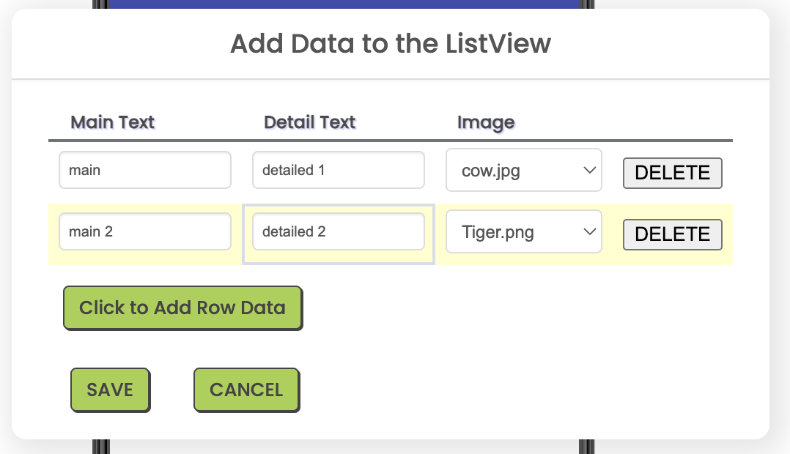
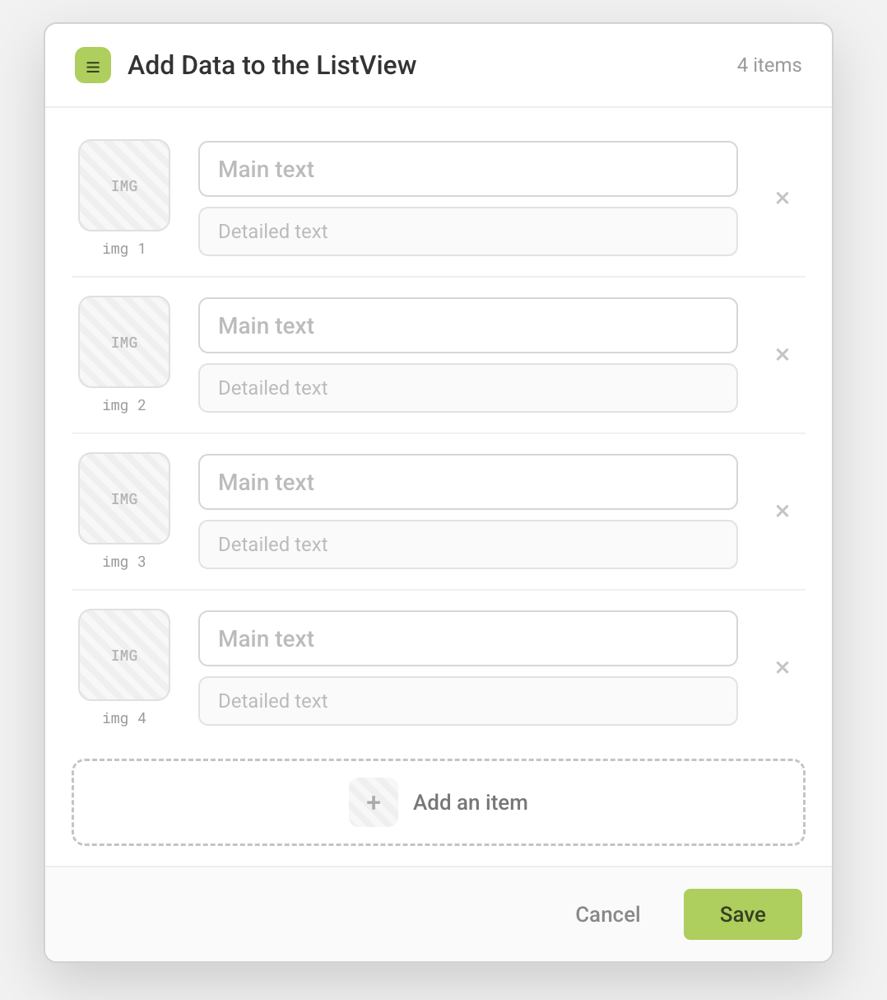
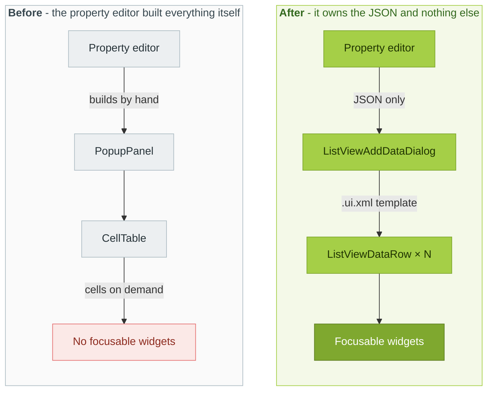
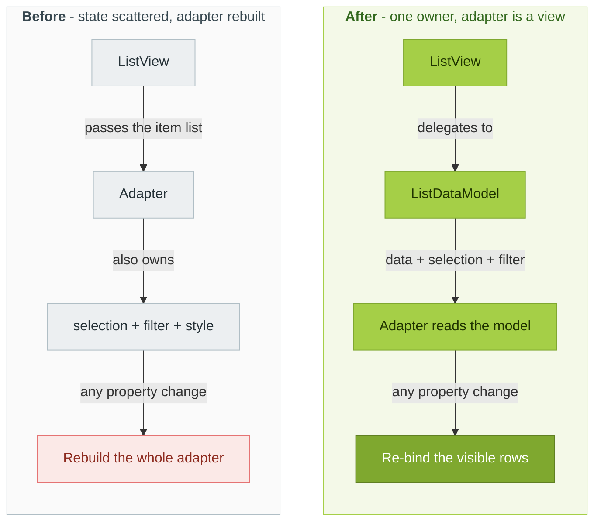

# GSoC 2026 — MIT App Inventor: ListView Component Update

**Contributor:** Mekala Jaya Nanda Prabhas ([@prabhasg5](https://github.com/prabhasg5))
**Organization:** MIT App Inventor
**Mentor:** Susan Lane
**Repository:** [mit-cml/appinventor-sources](https://github.com/mit-cml/appinventor-sources)

This page is my GSoC 2026 final work product. It links every pull request from the
program period, summarizes what each phase delivered, and states what is
still open. Both merged and unmerged code are linked.

---

## 1. Project goals

The ListView component ships as two independent, hand-written implementations —
Android (`ListView.java`) and iOS (`ListView.swift`) — that share no code and no
common interface. Every property, method, and event has to be written twice, so the
two drifted apart: a feature could work on Android and be missing, mistyped, or
subtly wrong on iOS, with no central record of where. Alongside that, the visual
List Item Editor in the Designer had real usability problems, and the component's
non-visual state (data, selection, filtering) was scattered across adapters rather
than owned by a single model.

The project set out to address four things:

1. **User Experience** — rebuild the List Item Editor on GWT **UiBinder**, replacing hand-built imperative GWT and a virtualized `CellTable` with declarative templates and real, focusable widgets.
2. **Reliability** — give both platforms a single `ListDataModel` that owns data, selection, and filtering, and fix the bugs that consolidation exposes.
3. **Extensibility** — add the capabilities the component was missing (multi-selection, in-place item replacement) on both platforms at once.
4. **Continuity** — establish a shared behavioral contract so Android/iOS parity is specified and tracked rather than discovered through bug reports.

### Where the project landed

All four phases were carried out. The **editor rebuild** is complete and merged — four
PRs migrated it to UiBinder, from a virtualized `CellTable` to accessible,
keyboard-navigable widgets. 

The **`ListDataModel`** consolidation is the largest body of work and is merged on both platforms, 
with one appearance-refactor PR still in review. 

**Extensibility** delivered `MultiSelect`, `SelectedItems`, and in-place item replacement 
for both platforms, all awaiting review.

**Cross-platform parity** improved throughout, mostly on iOS — filtering and
selection-under-filter were repaired (filtering was silently non-functional on iOS),
the `AddItem` defects were fixed, and iOS gained the same model ownership as Android.
Parity between two hand-written implementations is not something a single program
declares finished, so the final phase ends in a written contract plus an executed
audit rather than a claim of completeness: thirteen concrete behavioural gaps found,
two of them on Android rather than iOS. Details in [§3.4](#34-continuity--cross-platform-parity);   what remains unfixed is listed in [§4](#4-future-work).

---

## 2. Work completed, by phase

### 2.1 User Experience — List Item Editor rebuild

The List Item Editor — the dialog behind a ListView's **ListData → "Click to
Add/Delete Data"** button — is how every App Inventor user authors list content, so
it is one of the most-seen surfaces in the Designer. It was also hand-built
imperative GWT wrapped around a virtualized `CellTable`: a spreadsheet-style grid
where the image column was a bare filename dropdown, and where nothing could be
reached from the keyboard. That last part was structural, not an oversight — a
`CellTable` renders cells on demand instead of holding real focusable widgets, so
there was literally nothing for the browser to Tab to.

| Before | After |
|---|---|
|  |  |

It was rebuilt on GWT **UiBinder** across four merged PRs, each one enabling the
next:

- **[#3990](https://github.com/mit-cml/appinventor-sources/pull/3990)** — moved the dialog *chrome* into a UiBinder pair, `ListViewAddDataDialog.{java,ui.xml}`, and wrapped it in the accessible `wizards.Dialog` widget, so it gained an ARIA dialog role, a focus trap, Escape-to-close, and focus restore on close. The `CellTable` was deliberately left untouched inside, keeping the PR reviewable.
- **[#4008](https://github.com/mit-cml/appinventor-sources/pull/4008)** — completed the migration: the `CellTable` was replaced by `ListViewDataRow.{java,ui.xml}`, one row as a UiBinder `Composite` of real widgets — a `TextBox` for main text, an optional `TextBox` for detail, an image picker, and a delete `Button`. This is the change that made everything after it possible.
- **[#4023](https://github.com/mit-cml/appinventor-sources/pull/4023)** — redesigned those rows into a thumbnail-forward layout: **an image thumbnail** with its filename, a prominent main-text field over a lighter detail field, a live item count in the draggable title bar, and a click-the-thumbnail asset picker that previews each project image, chosen with the mentor over a dropdown variant.
- **[#4032](https://github.com/mit-cml/appinventor-sources/pull/4032)** — added full keyboard navigation on top of the real widgets: Enter to append a row and focus it, ↑/↓ for column-preserving movement between rows, Enter/Space to open the image picker or delete a row, Esc to close. Tab order came free once the rows were real widgets. Left/Right were deliberately left alone so they still move the caret.

**How the widget structure changed**

The property editor used to build the whole dialog itself and own a `CellTable`
that rendered cells on demand. Now it keeps only the JSON load/save logic and hands
off to `ListViewAddDataDialog`, a UiBinder template that composes one
`ListViewDataRow` per item — each row a real `Composite` with its own widgets and
its own `toJsonObject()`. Layout lives in `.ui.xml`, behavior lives in Java, and
every control is a focusable widget the browser already knows how to navigate.

Throughout all four PRs, the saved `ListData` JSON (`[{Text1, Text2, Image}]`)
stayed byte-for-byte identical, and nothing touched the components runtime or the
companion — the entire phase is Designer/appengine-only, so no existing project
could be broken by it.

▶ **[Keyboard-navigation demo](https://github.com/mit-cml/appinventor-sources/pull/4023)** — screen recording in PR #4023, also showing that the accessibility behavior from #3990 is preserved.

### 2.2 Reliability — `ListDataModel`

Before this phase, a ListView's data, selection, and filter state were scattered across the 
Android adapter and loose fields on the iOS ListView. This phase gave both platforms a single owning model. 
The aim was to give both platforms one class that owns all three, and to reduce the adapter to a thin view that reads from it.

- **[#4037](https://github.com/mit-cml/appinventor-sources/pull/4037)** — introduced `ListDataModel` and moved the item list into it on both platforms, behavior-neutral.
- **[#4041](https://github.com/mit-cml/appinventor-sources/pull/4041)** — fixed search filtering, which was silently broken on iOS (results were computed but never read), and defined the selection-under-filter policy: keep the selection while the item stays visible, clear it only when the filter hides it.
- **[#4053](https://github.com/mit-cml/appinventor-sources/pull/4053)** — moved Android's `selectedItems`/`originalPositions`/`Filter` into the model, using a thread-safe split (`computeFilter` on the background filtering thread, `commitFilter` on the UI thread) to avoid a `RecyclerView` count-mismatch crash.
- **[#4059](https://github.com/mit-cml/appinventor-sources/pull/4059)** — gave the iOS model the same mutation and selection-mapping API, replacing six duplicated copies of selection-derivation logic with one.
- **[#4062](https://github.com/mit-cml/appinventor-sources/pull/4062)** — moves Android's appearance properties into a `ListViewStyle` object so a color/font change re-binds the existing adapter instead of rebuilding it from scratch, which used to also silently wipe the selection highlight.

  Review also caught an extension-compatibility gap here. `setListAdapter` stayed public, but the adapter now needs a 
  `ListDataModel` and a `ListViewStyle` — both private, so no extension could build one to pass in.
   Fixed by exposing `getDataModel()` and `getStyle()`.

**How the data flow changed**

**What the model then made possible**

They are knots that had formed *because* no single class owned the state — each one held together by the others, 
so none was fixable on its own. Once ownership was fixed, they came apart:

| The tangle | What it cost | Untangled by |
|---|---|---|
| Selection and filtering shared state — `originalPositions` is filter state that selection reads | Neither could be moved, or tested, without the other | Both moved into `ListDataModel` together |
| Mapping a tapped visible row back to its real item needed the filter's internals | Selection logic was written against the filter's private representation | One `toOriginalPosition()` on the model |
| "What is selected" was stored twice — `selectionIndex` on `ListView`, the highlight set in the adapter | The two copies were hand-synced, so they could silently disagree | A single source of truth in the model |
| `BackgroundColor` rebuilt the adapter, but passed `elementColor` into it | A full rebuild that never changed anything | Rebuild deleted outright |

Two more followed from the same change:

- **Appearance changes stopped rebuilding the list.** The adapters styled rows in `onCreateViewHolder`, which `RecyclerView` calls only a handful of times per list, so no `notify*` could restyle existing rows and swapping the whole adapter was the only lever — 16 `setAdapterData()` call sites, and a constructor that built the adapter ~15 times. Styling moved to `onBindViewHolder`, so a change now mutates a shared `ListViewStyle` and re-binds. The list no longer jumps back to the top, which is what a rebuild did to anyone scrolled 30 rows down.
- **Filtering left the UI thread.** `computeFilter` is pure and runs on the background filtering thread; `commitFilter` swaps the result in on the UI thread, avoiding a `RecyclerView` count-mismatch crash.

And because the logic now lives in one plain class instead of inside an adapter, it
became unit-testable on its own — `ListDataModelTest` covers filtering, the
filtered-row-to-real-item mapping, and the keep-while-visible selection policy.

### 2.3 Extensibility

This phase added two things an app simply could not do before: **select more than one
row**, and **replace a single row without rebuilding the list**. Each landed on
Android and iOS in the same pull request.

- **[#4067](https://github.com/mit-cml/appinventor-sources/pull/4067)** — exposes `MultiSelect` on Android, where it existed but was hidden from the designer and the blocks, and implements it from scratch on iOS, where `ListView.swift` had no reference to it at all. Adds `SelectedItems` on both platforms: a read-only list of what is picked, in the order it was picked.
- **[#4068](https://github.com/mit-cml/appinventor-sources/pull/4068)** — adds `UpdateItemAtIndex` on both platforms, replacing one row in place. The replaced row loses its selection, since a different item now occupies that position; nothing moves, so selections around it are untouched.

Extensibility here also means *not breaking the people already extending the component*. 
The custom-adapter hook used by third-party extensions was preserved
across the internal refactors, and where consolidation quietly made it unusable it
was repaired in review — see the `getDataModel()` / `getStyle()` note under
[#4062](#32-reliability--listdatamodel) above.

### 2.4 Continuity — cross-platform parity

Android and iOS are separate hand-written implementations with no shared code, so
every property has to be built twice and the two drift apart quietly. Nothing said
what correct behaviour *was*, which meant gaps were only ever found the slow way —
one user bug report at a time. This phase set out to write that specification down
and then measure both platforms against it.

**What iOS gained.** Parity work ran through the whole project, not only this phase.
Collected in one place, iOS now matches Android on:

- **Text rendering** — `TextAlignmentMain` and `TextAlignmentDetail`, which Android had and iOS did not; long main text wrapping inside its half of a two-text row instead of pushing the detail label off-screen; detail text wrapping rather than truncating; short text honouring its alignment instead of sitting at the leading edge.
- **Search** — filtering, which was entirely non-functional on iOS: results were computed and then never read, so typing did nothing. Matching is now case-insensitive across main and detail text, and a tapped row maps back to the correct item while a filter is active.
- **Adding items** — `AddItem` and `AddItemAtIndex`, which never triggered a refresh and appended to the wrong backing array on plain-text lists, hiding the rows already there.
- **State ownership** — the same `ListDataModel` as Android, with six duplicated copies of selection-derivation logic collapsed into one.
- **Selection** — moved off UIKit's own selection state, which `reloadData()` wipes on every filter keystroke, into the model as original-item indexes.
- **New capabilities** — `MultiSelect` and `SelectedItems`, neither of which existed in `ListView.swift`, and `UpdateItemAtIndex`, both delivered on the two platforms together.

**The contract and the audit.** This work is carried upstream in **[#4073](https://github.com/mit-cml/appinventor-sources/pull/4073)** ("Add ListView cross-platform behavioral contract and parity tracker"). Two documents came out of this phase, both in this
repository:

- **[`LISTVIEW_PARITY_CONTRACT.md`](./LISTVIEW_PARITY_CONTRACT.md)** — the behavioural contract and parity tracker. It states, platform-neutrally, how all 43 public members should behave, then records the status of each on each platform. It is written as a specification both implementations conform to, not as "iOS must copy Android" — which matters, because Android is not always right.
- **[Parity audit report](./ListViewParityAuditReport_22-08-2026.pdf)** (PDF) — the results of running that contract as a test, carried out on **21–22 August 2026**. One app, one identical sequence of steps, executed on the Android emulator and the iOS simulator with companions built from the same commit. Every member exercised on both; nothing inferred from one platform alone.

The audit found **13 defects — 11 on iOS in five clusters, and 2 on Android**. The
Android pair matters more than the count suggests: `SelectionIndex` does not clamp
out-of-range values despite its own documentation saying it does, and iOS is the
platform that gets this right. Two long-standing suspicions from the original
proposal — `SelectionColor` not applying visually and `DividerColor` failing at
runtime on iOS — were re-tested and **do not reproduce**, so they are closed rather
than carried forward.

Every member was exercised on both platforms, so no row is left unverified — the
Android column reports observed results too, rather than being assumed correct by
default.

## 3. Future work

**Where the audit points next.** The parity review also provided a clear picture of the remaining differences between Android and iOS. 
These differences have been documented, along with their root causes wherever they could be identified. They provide a useful starting point for future improvements and can be addressed individually without repeating the earlier investigation.

| Fix | Platform | Effort |
|---|---|---|
| `ImageWidth` / `ImageHeight` rendering at a quarter of the requested size | iOS | Small — root cause located |
| `HintText` placeholder never reaching the filter bar | iOS | Small — root cause located |
| `SelectionDetailText` default (`"Uninitialized"` vs `""`) | Android | Small |
| `DividerThickness`, `ElementCornerRadius`, `ElementMarginsWidth` accepted but ignored | iOS | Moderate — one code area |
| Content dropped instead of the row growing at large font sizes | iOS | Design work |
| Horizontal `Orientation` — several items shown at once, text truncated, filter bar missing | iOS | Design work |

**Horizontal layout wants a redesign, not a new feature.** A carousel-style layout was
raised early on, and a horizontal layout already exists and works. The gap is
presentation rather than capability — items spill past the edge of the screen instead
of paging cleanly one at a time, which is independently what the audit flagged under
`Orientation`. That makes it a redesign of the existing layout, left for future work.

---

## 4. Lessons learned

- **Inspect before you guess.** Looking at the actual runtime behavior, layout, or platform code often gave me the answer faster than guessing at it did.
- **Don't layer fixes.** Stacking one fix on top of another makes it harder to know what actually worked. That callback is harder on the next person too — not just me, but whoever has to review the diff.
- **Ship the documented gap over blocking on one more fix.** Not every issue has to be fixed immediately. Clearly documenting what remains and why lets the work move forward without hiding what's unfinished.
- **Being willing to be wrong is part of the growth.** There were many times my initial assumption about a problem was wrong. The process of realizing that and correcting course is what made me more comfortable working in unfamiliar code — uncertainty unlocks real-world engineering.

---

## 5. Conclusion

This summer taught me that uncertainty unlocks real-world engineering.

I started this program as a third-year student who had mostly written code in isolation but now completed a Architecture level redesign in MIT app inventor where it affects its 18-year old code base with over 20M users.

The work rarely went as planned. I had to walk through unfamiliar code, questioning my assumptions and even late night bug fixes and accepting when I was wrong.  I learned that making a good fix is knowing what to leave out than what to include.  

Most importantly, I learned that contributing to a large open-source project is not about getting everything right on the first attempt. It is about learning from what goes wrong, making the next decision better, and leaving the project clearer than I found it for the next contributors.

My proposal ended with: “I am here to learn, build, and make an impact.” Looking back, I think I did all three.

I got exactly the long journey I said I was hoping for. I'd like to keep going.

---

## 6. Appendix — full pull request ledger

Work that sits outside the four phases is listed separately below: earlier
contributions, side fixes taken on during the program, and the branch-sync pull
requests that carried the ListView work between `master` and `ucr` — including
resolving another contributor's iOS pull request against it so both survived.

### GSoC-period PRs (by phase)

| PR | Title | Status |
|---|---|---|
| [#3990](https://github.com/mit-cml/appinventor-sources/pull/3990) | Migrate ListView ListData editor dialog chrome to UiBinder | ✅ Merged |
| [#4008](https://github.com/mit-cml/appinventor-sources/pull/4008) | Migrate ListView ListData editor rows from CellTable to UiBinder widgets | ✅ Merged |
| [#4023](https://github.com/mit-cml/appinventor-sources/pull/4023) | Redesign ListView ListData editor with a thumbnail-forward layout | ✅ Merged |
| [#4032](https://github.com/mit-cml/appinventor-sources/pull/4032) | Add keyboard navigation to the ListView ListData editor | ✅ Merged |
| [#4037](https://github.com/mit-cml/appinventor-sources/pull/4037) | Introduce ListDataModel to own the ListView item list | ✅ Merged |
| [#4041](https://github.com/mit-cml/appinventor-sources/pull/4041) | Fix ListView search filtering and selection (iOS + Android) | ✅ Merged |
| [#4053](https://github.com/mit-cml/appinventor-sources/pull/4053) | Move Android ListView filtering and selection into ListDataModel | ✅ Merged |
| [#4059](https://github.com/mit-cml/appinventor-sources/pull/4059) | [iOS] Make ListDataModel own the ListView's list mutations and selection mapping | ✅ Merged |
| [#4062](https://github.com/mit-cml/appinventor-sources/pull/4062) | Stop rebuilding the ListView adapter when an appearance property changes | 🟡 Open |
| [#4067](https://github.com/mit-cml/appinventor-sources/pull/4067) | Feature/ListView MultiSelect (Android + iOS) | 🟡 Open |
| [#4068](https://github.com/mit-cml/appinventor-sources/pull/4068) | Feature/ListView replace an item in place (Android + iOS) | 🟡 Open |
| [#4073](https://github.com/mit-cml/appinventor-sources/pull/4073) | Feature/listview-parity-contract — cross-platform behavioral contract and audit | 🟡 Open |

### Related contributions

| PR | Title | Status |
|---|---|---|
| [#4004](https://github.com/mit-cml/appinventor-sources/pull/4004) | Fix ListView image scroll lag (image caching) | 🟡 Open — deployed to the test server for user evaluation |
| [#4051](https://github.com/mit-cml/appinventor-sources/pull/4051) | Bring #3958 iOS ListView changes into ucr (ListView.swift only) | ✅ Merged |
| [#4050](https://github.com/mit-cml/appinventor-sources/pull/4050) | Merge master into ucr — resolve ListView.swift (ListDataModel + #3958) | ✅ Merged |
| [#4064](https://github.com/mit-cml/appinventor-sources/pull/4064) | Sync the iOS ListDataModel consolidation from master into ucr | ✅ Merged |
| [#4047](https://github.com/mit-cml/appinventor-sources/pull/4047) | [iOS] Merge #3958 to current master, resolve ListView.swift | ⚪ Closed, superseded by #4050/#4051 |
| [#3823](https://github.com/mit-cml/appinventor-sources/pull/3823) | Fix Blocks Editor refresh when BlocksToolkit changes without runtime reset errors | ✅ Merged |
| [#3943](https://github.com/mit-cml/appinventor-sources/pull/3943) | Corrected a small listener bug in setDivider() | ✅ Merged |
| [#3944](https://github.com/mit-cml/appinventor-sources/pull/3944) | Add TextAlignmentMain and TextAlignmentDetail properties to ListView | ✅ Merged |
| [#3800](https://github.com/mit-cml/appinventor-sources/pull/3800) | Fix Blocks Editor not updating when BlocksToolkit property is changed | ⚪ Closed, superseded by #3823 |
| [#3935](https://github.com/mit-cml/appinventor-sources/pull/3935) | Fix: a small listener bug in setDivider() - Android | ⚪ Closed, superseded by #3943 |
| [#3844](https://github.com/mit-cml/appinventor-sources/pull/3844) | Fix iOS ListView selection color | ⚪ Closed — same fix landed upstream in [#3708](https://github.com/mit-cml/appinventor-sources/pull/3708) |
